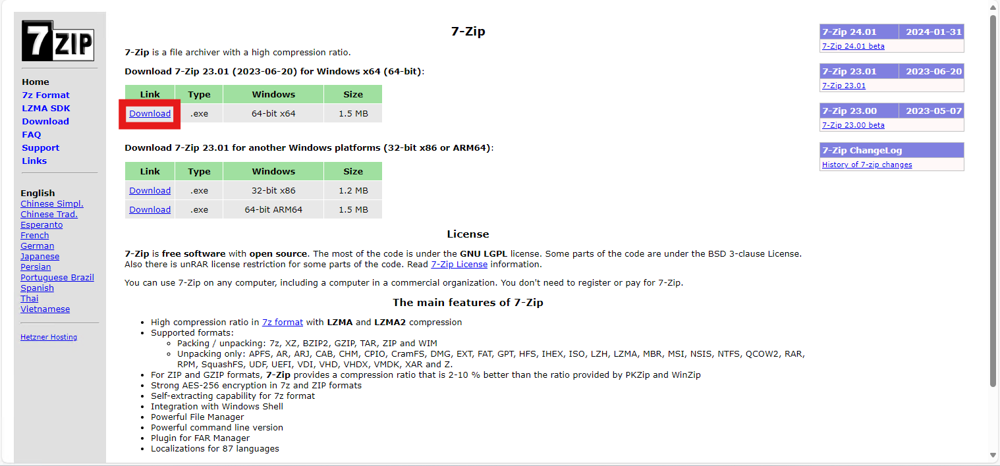
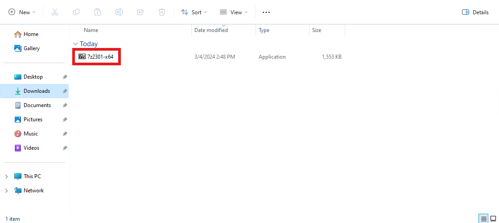
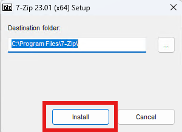
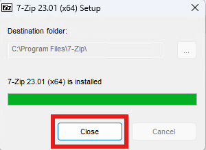
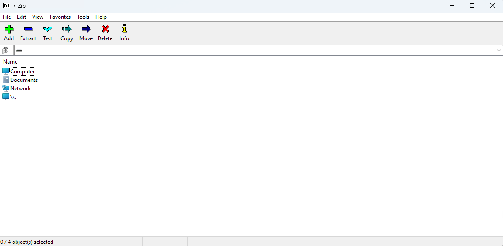

---

title: How to install 7-Zip

---

> Guide by Meowcat285

---

## Step 1: Download 7-Zip

You can download 7-Zip at [https://www.7-zip.org/](https://www.7-zip.org/)

Press the download button here:

{ loading=lazy }

!!! note

    Unless you know that you are using 32-bit Windows, you should use the download button that is highlighted in the above image.

---

## Step 2: Run the installer

Navigate to your downloads folder and run the downloaded file

{ loading=lazy }

Then select `Install` in the window that appears

{ loading=lazy }

When it is done installing, select `Close`

{ loading=lazy }

---

## Step 3: Run 7-Zip

You can find 7-Zip in your start menu under the `7-Zip` folder

{ loading=lazy }

Go ahead and run it to make sure it works, if all is correct, you should see something like this:

{ loading=lazy }

Congrats! You have successfully installed 7-Zip!

---

> Credits: Meowcat285